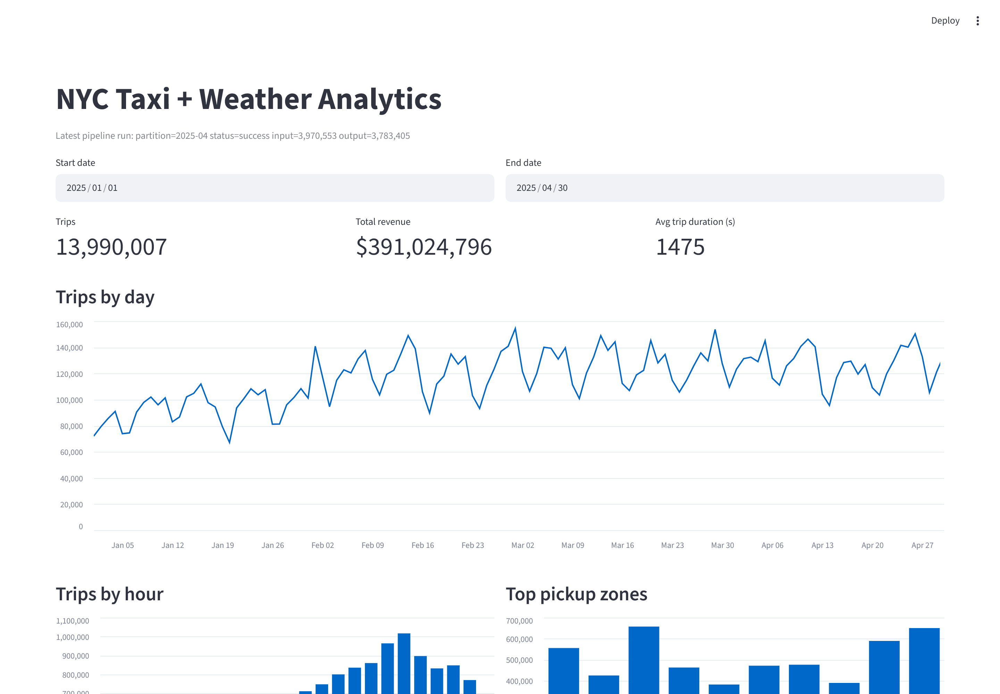
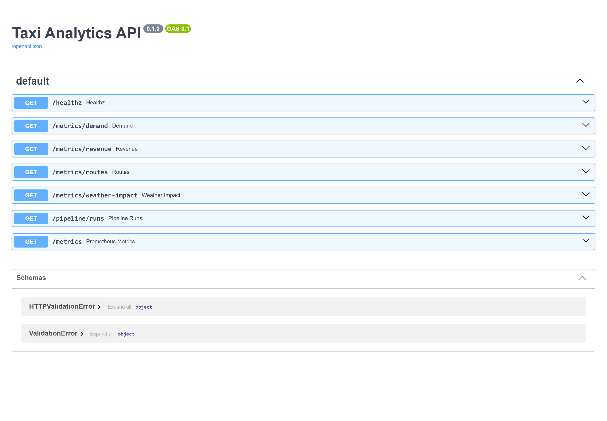

<div align="center">

# Large-Scale Data Pipeline

**A production-style transportation analytics platform** that ingests **15M+ NYC taxi trips**, enriches them with historical weather, models them with dbt, and serves interactive dashboards and a query API.

Batch ingestion · Incremental processing · Data quality · Distributed execution · Data warehousing · Orchestration · Observability · CI/CD

[](https://github.com/OSTADJ2F/large-scale-data-pipeline/actions/workflows/ci.yml)




</div>

---

## Results at a glance

| Metric | Value |
| ------ | ----- |
| Raw records processed | **15.2M** across 4 monthly source files |
| Enriched fact rows | **13,990,007** |
| Analytical marts | 4 (daily, hourly, route, weather-impact) |
| Automated tests | **67** (unit, integration, data-quality, end-to-end) |
| dbt data tests | **21** (uniqueness, relationships, accepted values) |
| Single-month validation | 3.48M rows in **2.6s** (Polars) |
| Mart query latency | **~1 ms** (DuckDB) / sub-second (PostgreSQL) |

## Highlights

- **Idempotent, immutable ingestion** — checksummed raw layer, re-runs never duplicate or overwrite source data.
- **Real data-quality enforcement** — Pandera schemas + custom rules route records into `valid` / `invalid` / `quarantined`, and the pipeline *fails* when quality thresholds are breached.
- **Incremental + backfill processing** — month-partitioned checkpoints stored in a `pipeline_runs` table; failed partitions retry safely, completed ones are skipped.
- **dbt data marts** — versioned, tested, documented SQL that rebuilds deterministically from Parquet.
- **Orchestrated** — an Airflow DAG (`check_source → ingest → validate → normalize → enrich → build → test → metrics → load`) with retries and backfill support.
- **Observability built in** — structured JSON logs, Prometheus metrics, alert rules, and a live pipeline-status panel in the dashboard.
- **Scales** — columnar partition pruning locally, plus a parity PySpark path for distributed execution.
- **Reproducible** — Docker Compose for infrastructure, GitHub Actions CI, and one-command start/stop/smoke scripts.

## Architecture

```text
                    NYC TLC (Parquet)          Open-Meteo (JSON)
                          │                          │
                          ▼                          ▼
              ┌──────────────────────────────────────────────┐
              │  Raw ingestion  (idempotent, checksummed)     │
              └──────────────────────────────────────────────┘
                          │
                          ▼
              ┌──────────────────────────────────────────────┐
              │  Immutable object storage  (MinIO / local)    │
              └──────────────────────────────────────────────┘
                          │
                          ▼
              ┌──────────────────────────────────────────────┐
              │  Validation  →  valid | invalid | quarantined │
              └──────────────────────────────────────────────┘
                          │
                          ▼
              ┌──────────────────────────────────────────────┐
              │  Normalization  →  date-partitioned Parquet   │
              └──────────────────────────────────────────────┘
                          │
                          ▼
              ┌──────────────────────────────────────────────┐
              │  Weather enrichment  (nearest-hour join)      │
              └──────────────────────────────────────────────┘
                          │
                          ▼
              ┌──────────────────────────────────────────────┐
              │  Analytical marts  (dbt-duckdb)               │
              └──────────────────────────────────────────────┘
                          │
                          ▼
              ┌──────────────────────────────────────────────┐
              │  Serving database  (PostgreSQL)               │
              └──────────────────────────────────────────────┘
                          │
                 ┌────────┴────────┐
                 ▼                 ▼
        Streamlit dashboard     FastAPI query API
```

**Storage layers** (never mixing raw and derived data):

```text
data/
├── raw/          # immutable source files
├── validated/    # valid | invalid | quarantined + JSON reports
├── staging/      # normalized, pickup_date-partitioned Parquet
├── curated/      # weather-enriched Parquet
└── marts/        # analytical aggregates (DuckDB + PostgreSQL)
```

## Screenshots

**Query API** — FastAPI with interactive OpenAPI docs.



> The dashboard screenshot is shown at the top of this README.

## Tech stack

| Layer | Technology |
| ----- | ---------- |
| Processing | Python 3.10, **Polars**, PySpark (optional) |
| Orchestration | **Apache Airflow** (Docker) |
| Storage | **MinIO** (S3-compatible) / local filesystem |
| Warehousing | **DuckDB**, **PostgreSQL** |
| Transformations | **dbt-duckdb** |
| Data quality | **Pandera** + custom rules + dbt tests |
| Dashboard / API | **Streamlit** / **FastAPI** |
| Observability | structlog, **Prometheus**, Grafana |
| Infra / CI | Docker Compose, GitHub Actions |

## Quick start

**Prerequisites:** Python 3.10, Docker Desktop (running), `git`.

```powershell
git clone https://github.com/OSTADJ2F/large-scale-data-pipeline.git
cd large-scale-data-pipeline

.\make.ps1 setup                                  # create venv + install deps
Copy-Item .env.example .env
docker compose up -d                              # PostgreSQL + MinIO
.\make.ps1 doctor                                 # verify configuration
```

**Populate data** (one month is plenty to explore):

```powershell
python -m pipeline run --start-date 2025-01-01 --end-date 2025-01-31
```

**Run the app** with a single command (starts API + dashboard, then smoke-tests):

```powershell
.\make.ps1 serve
```

| Service | URL |
| ------- | --- |
| Dashboard | http://localhost:8501 |
| API docs | http://localhost:8000/docs |
| API metrics | http://localhost:8000/metrics |

Manage services:

```powershell
.\make.ps1 status    # what is running
.\make.ps1 smoke     # verify API, dashboard, and database
.\make.ps1 stop      # stop API + dashboard
```

## Pipeline commands

```powershell
python -m pipeline ingest   --start-date 2025-01-01 --end-date 2025-01-31
python -m pipeline validate --start-date 2025-01-01 --end-date 2025-01-31
python -m pipeline normalize --start-date 2025-01-01 --end-date 2025-01-31
python -m pipeline enrich   --start-date 2025-01-01 --end-date 2025-01-31
python -m pipeline quality                      # dbt run + tests
python -m pipeline load                         # marts -> PostgreSQL

python -m pipeline run --date 2025-01-15         # incremental (idempotent)
python -m pipeline run --start-date 2025-01-01 --end-date 2025-04-30
python -m pipeline backfill --start-date 2024-01-01 --end-date 2024-12-31

python -m pipeline metrics                       # Prometheus text format
python -m pipeline alerts                        # operational alert checks
```

> `make` / `make.ps1` targets mirror these: `setup`, `test`, `lint`, `format`, `doctor`, `ingest`, `transform`, `pipeline`, `dashboard`, `api`, `serve`, `stop`, `status`, `smoke`, `up`, `down`.

## Data sources

| Source | Format | Description |
| ------ | ------ | ----------- |
| `taxi_trips` | Parquet | NYC TLC Yellow Taxi trips (monthly) |
| `taxi_zones` | CSV | Taxi-zone id → borough/zone lookup |
| `weather` | JSON | Open-Meteo historical hourly weather (NYC) |

Configured in [`config/sources.yaml`](config/sources.yaml); overridable via environment variables.

## Schema

Canonical trip schema (staging/curated):

| Column | Type | Description |
| ------ | ---- | ----------- |
| `pickup_datetime` / `dropoff_datetime` | timestamp | naive America/New_York |
| `pickup_date` / `pickup_hour` / `pickup_day_of_week` | date/int/int | derived |
| `pickup_location_id` / `dropoff_location_id` | int | TLC taxi-zone id |
| `passenger_count` | int | nulls defaulted to 0 |
| `trip_distance` | float | miles |
| `trip_duration_seconds` / `average_speed` | float | derived |
| `fare_amount` / `tip_amount` / `total_charge` | float | currency (USD) |
| `payment_type` | string | `credit_card`, `cash`, … |
| `is_airport_trip` | bool | derived |
| `temperature` / `precipitation` / `wind_speed` / `weather_condition` | various | weather |

**Time zone:** TLC and Open-Meteo timestamps are naive **America/New_York** local time; weather is joined by **nearest hour** (floor-to-hour on pickup time), which handles DST transitions correctly.

**Analytical marts:** `daily_demand`, `hourly_demand`, `route_performance`, `weather_impact` (documented and tested in [`dbt/models/marts`](dbt/models/marts)).

## Data quality

- **Pandera schema** validates column presence and types.
- **Correctness rules:** dropoff before pickup, negative distance/fare/tip, invalid passenger counts, invalid location IDs, invalid payment types.
- **Quarantine:** critical nulls, exact duplicates, and physically implausible outliers.
- **Thresholds** (`QUALITY_MAX_INVALID_RATIO`, `QUALITY_MAX_NULL_RATIO`) fail the pipeline when exceeded.
- **dbt tests (21)** enforce uniqueness, referential integrity, accepted values, and non-null constraints on every mart.

Validation reports are saved as JSON artifacts under `data/validated/trips/reports/`.

**Findings on real data (Jan–Apr 2025):** the pipeline surfaced non-standard `payment_type=0` (up to 806k rows/month, correlated with null `passenger_count`), negative adjustment fares (~5%), and late-arriving trips from adjacent months — each handled and documented rather than silently dropped.

## Performance

Benchmarked on one month (3.48M rows, 56 MB Parquet):

| Stage | Time |
| ----- | ---- |
| Read raw Parquet | 0.06s |
| Validate | 2.59s |
| Normalize | 0.03s |
| Enrich (join) | 0.05s |
| Top-zones query | ~0.001s |

- Peak memory ~3.3 GB (in-memory columnar processing).
- Ingestion downloads multiple files in parallel (`WORKERS`).
- End-to-end: **15.2M rows** across 4 months.
- **Scaling:** for datasets beyond memory, the same logic is available as a PySpark job (`scripts/spark_job.py`, `pipeline/spark/`) for any Spark cluster.

## Observability

- Structured JSON logs via **structlog**.
- **Prometheus metrics** at `GET /metrics`: rows ingested/rejected/transformed, run duration, job failures, storage bytes, query latency, last-success timestamp.
- Alert rules (`monitoring/alert_rules.yml`): pipeline failure, no data, high failure rate, slow runs.
- Optional Grafana dashboard: `docker compose --profile monitoring up -d`.

## Testing & CI

```powershell
.\make.ps1 test        # 67 tests
.\make.ps1 lint
```

Coverage includes unit tests (parsers, normalizers, rules, config), integration tests (object storage, validation, weather joins), data-quality invariants, and an **end-to-end test** over a small fixture dataset with no external downloads. GitHub Actions runs **lint + tests + `dbt parse`** on every push.

## Project structure

```text
pipeline/      Python package (ingest, validate, normalize, enrich, incremental, spark, observability)
dbt/           dbt-duckdb models, tests, and schema docs
airflow/       Airflow DAG + Docker image
api/           FastAPI query API
dashboard/     Streamlit dashboard
monitoring/    Prometheus + Grafana config
scripts/       dev helper (serve/stop/smoke), benchmarks, Spark job
config/        data-source manifest and settings
tests/         unit, integration, data-quality, and end-to-end tests
```

## Deployment

```powershell
docker compose up -d                                        # PostgreSQL + MinIO
docker compose --profile monitoring up -d                   # + Prometheus + Grafana
docker compose -f airflow/docker-compose.yaml up -d         # Airflow (localhost:8080)

docker build -t taxi-analytics .                            # API + dashboard + CLI image
docker build -f airflow/Dockerfile -t taxi-analytics-airflow .
```

**Backups:**

```powershell
docker exec pipeline-postgres pg_dump -U taxi taxi > backup.sql
tar -czf data-backup.tar.gz data/
```

## Design decisions

- **Naive local timestamps** are kept consistent between trips and weather rather than converting to UTC, avoiding DST ambiguity.
- **DuckDB for transforms, PostgreSQL for serving** — fast local analytics without giving up a reliable serving store.
- **Month-level partitions** match the source file granularity; late-arriving data is captured when its month is (re)processed.
- **Marts are `table` materializations** — deterministic and fully rebuildable; incremental behavior is handled at the pipeline partition level.

## Known limitations & roadmap

- Naive America/New_York timestamps (documented, consistent).
- In-memory Polars is bounded by RAM; use the Spark path for larger scales.
- The PySpark path requires a Java runtime and is not exercised in default CI.
- Roadmap: Great Expectations suite, Terraform for cloud infra, dbt incremental models, and a Next.js dashboard.

## License

[MIT](./LICENSE)
